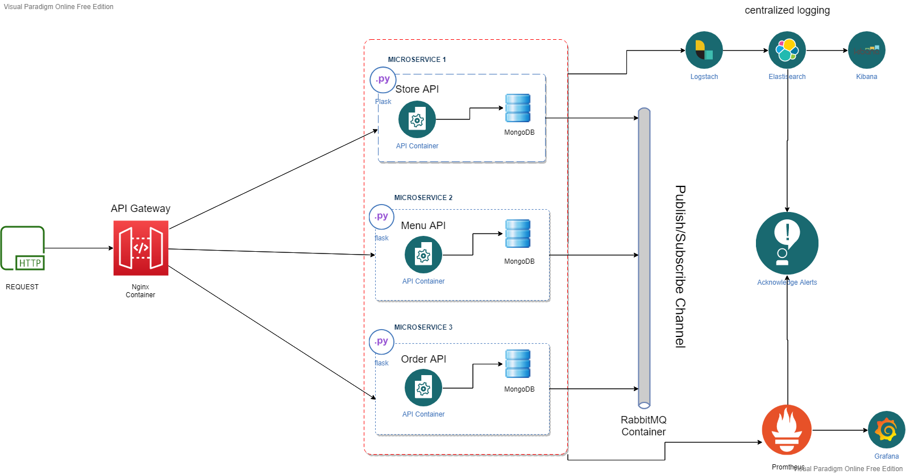

# COMP3122-Project-Group11

Authors:
- Srijan SRIVASTAVA (19085314D)
- Adilet DANIIAROV (18078666D)
- Mario CHANGI (17086999D)

## OpenFood API

The API will be created using event-driven microservice based architecture.
The API will be divided into three major microservices:
- Store API
- Menu API
- Order API

Each microservice will be created using Flask, and each microservice will utilize MongoDB as their database. Each microservice will have it's own database.
The messages between the microservices will be using the publish/subscribe channel which will be incorporated using [RabbitMQ](https://www.rabbitmq.com/).

For centralized logging of application events, ELK stack will be used.
Grafana and Prometheus will be used for collecting microservice metrics.

Appropriate message alerts will be sent for health issues and when new serivces are implemented.

The microservice architecture is depicted as below:

**TODO** 
- Decide on automated testing mediums.
- Decide on DevOps platform.
- Complete the microservices.